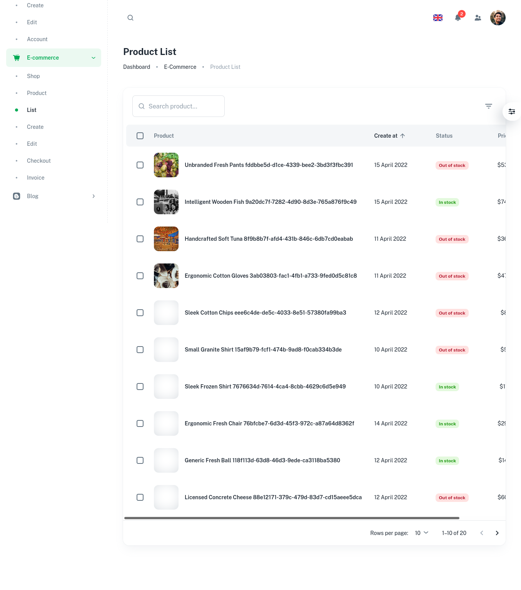

# Welcome to the Sabil Project By MERN-STACK
### This is a functional ecommerce web application that is developed by using React, Redux, Node.js, Express, MongoDB.
#### This Project includes two repositories, this repo is client-side, server-side repo is [here](https://github.com/shakilhasan/sabil-api)

Below are the sample of a product-shop and list page:




## Technology stack

This repository is built on top of Express.js and React.js, however in the implementation detail, we will find other supporting technologies as well.

#### Client side

- React - A JavaScript library for building user interfaces
- Material-UI Design - A design system for enterprise-level products. Create an efficient and enjoyable work experience

#### Server side

- Node.js - evented I/O for the backend
- Express.js - Fast, unopinionated, minimalist web framework for Node.js
- MongoDB - The application data platform for NoSQL databases
- Mongoose - mongoose
- Swagger - Swagger (Not done yet)

Details frameworks and packages can be found in the package.json files in server and client repository.
## Running the application
#### Prerequisites

- Node.js : To run npm packages
- MongoDB : As a database for the application

##### Steps

- we should run the server and client side projects separately, and also make sure mongodb is up and running.
- Create a `.env` file inside of the `server` repo. Add the below entries or change accordingly. You can follow the `.env.sample` file to see the format.

  ```
  DB_HOST=localhost
  DB_PORT=27017
  DB_NAME=sabil-api
  JWT_SECRET=JWT_SECRETfsdfsdfsdsd3435353
  JWT_EXPIRES_IN=3600
  PORT=8080
  IS_MONGODB_CLOUD_URL=false
  MONGODB_CLOUD_URL=mongodb+srv:// <USER >: <PASSWORD >@cluster0.abcd.mongodb.net/myFirstDatabase?retryWrites=true
  ```

#### Server commands
We assume mongodb is up and running.
```sh
npm i
npm run db:up
npm start
```

#### Client commands

```sh
nvm use --lts
npm i
npm start
```

## Data seeding

To seed the database, we need to run the following commands.

```sh
npm run db:seed
npm run db:migrate
```

You should be able to see the username and password in the `/setup/users.json` file.

## 🔗 Important Links ❗
- ✅ Server-side (Back-End):  [Source Code](https://github.com/shakilhasan/sabil-api)
- 🔴 Project Live : [Sabil-App](https://sabil.vercel.app)
